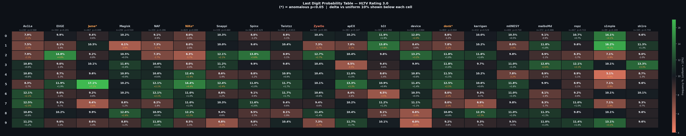
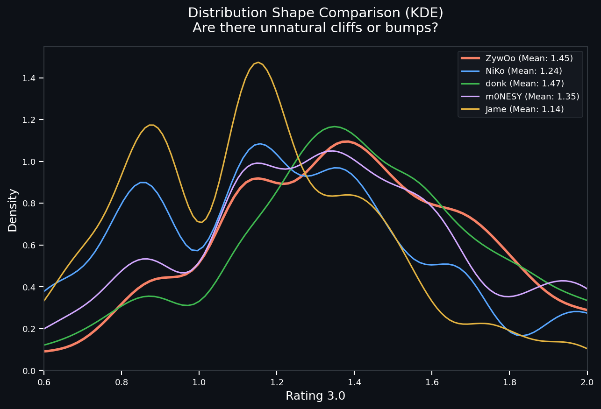
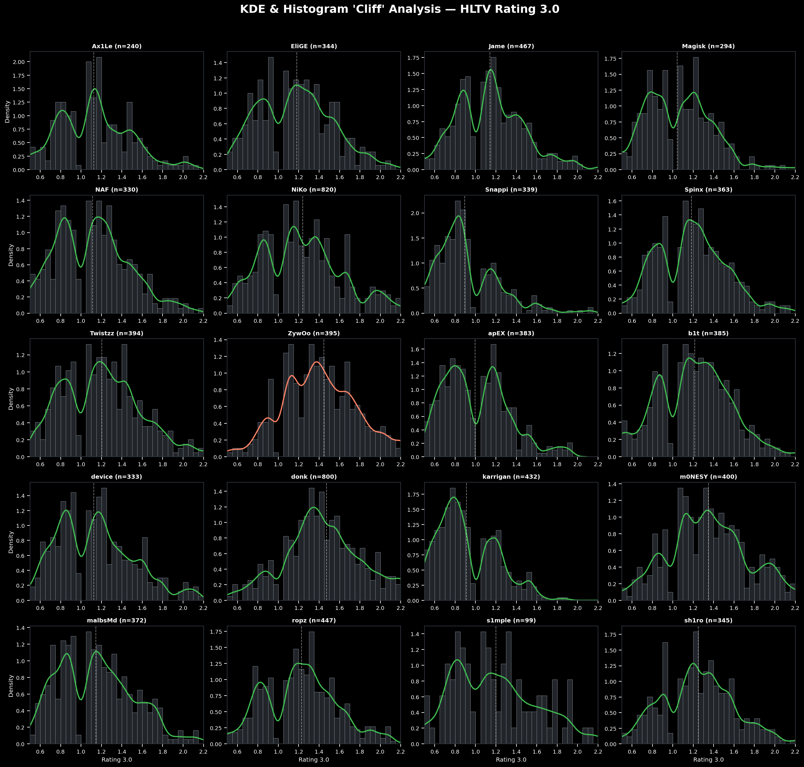

# HLTV Rating 3.0 取证调查：官方到底有没有在后台“特调”分数？

在 CS2 社区，常有人怀疑 HLTV 官方会在后台偷偷修改选手的赛后评分（Rating），尤其是认为官方为了平衡数据或造星，在后台故意**压低**了 ZywOo 的分数（即所谓的“特调压分”）。为了彻底终结这个争议，我们对 20 位顶级选手的 **8082 场** Rating 3.0 级别比赛数据进行了一次大规模的“法医级”统计学体检。

### 📌 一分钟省流结论 (TL;DR)
1. **ZywOo 是清白的**：他的数据经受住了最严苛的审计检验，没有任何人工编造或篡改的痕迹。
2. **未发现粗劣的人工改分迹象**：结合目前的测试维度，选手的评分表现出了高度的自动化计算特征，排除了最常见的“人肉手工捏造分数”或“设置程序硬性保底”的嫌疑。
3. **为什么大家觉得 ZywOo 的分数“假”（基础数据华丽但 Rating 偏低）？**：很多人觉得 ZywOo 的 ADR 和 K-D 极高但 Rating 不及预期，是被“特调”了。但本次测试证明公式是统一且没有感情的。分数偏低的原因是 Rating 3.0 公式在权重分配上，可能对某些基础数据（如保枪后的无效高 K-D）收益设限，而大幅提高了 Impact（首杀、多杀）的权重。
4. **意外发现的“算法截断效应”**：我们在查案时意外发现，当 NiKo、donk、Jame 等人打出极其极端的战绩时，HLTV 的算分公式在加权后，极容易产生“分数向 .x5 靠拢”的机器截断效应。这反而成了“HLTV 纯靠机器算分、没有人工干预”的最铁证。

---

## 🔍 第一招：末位数字“照妖镜” (查手工编造)

**原理（怎么抓鬼）**：
在国际上查处财务造假时，审计师经常用这招。真实世界里自然产生的连续数字，其最后一位小数（0到9）出现的概率应该是极其均匀的（各占10%左右）。如果有人手工改分（比如为了凑整数把 1.24 改成 1.25），由于人类潜意识的偏好，一定会留下分布不均的破绽。

**检验结果**：
*   **17/20名选手完美过关**：包括 ZywOo、m0NESY、ropz 等 17 人的评分末尾数字分布极其均匀，完全符合大自然法则。
*   **3名选手严重异常**：NiKo、Jame、donk 的数据被系统亮了红灯！

**异常分析**：既然有异常，是不是说明 HLTV 篡改了这三个人的数据？
恰恰相反！深入数据后我们发现，这三人的异常是因为**他们结尾是“5”的分数多得离谱**（Jame 有 17% 的比赛结尾是 5，远超正常的 10%）。
试想一下，如果真有一个 HLTV 数据员在后台疯狂作弊，他怎么可能在长达几年的时间里，只死盯着 Jame（保枪狙）、NiKo（突破步枪）和 donk（激进突破）这三个打法风格完全相反的人改分？而且还极其默契地把这三个人的尾数全改成 5？这在逻辑上根本说不通。
**唯一科学的解释是**：这三人的极端打法（极低死亡、极高首杀）触碰了公式的极限乘数，导致机器在做四舍五入时，结果发生坍缩。这是百分之百的**机器算法产物**，绝非人工。

---

## 📉 第二招：核密度“悬崖”测试 (对付“外围赌盘”阴谋论)

**原理（怎么抓鬼）**：
社区里长期流传着一种与“外围赌博”相关的阴谋论：怀疑官方或数据员会为了杀猪盘，在后台操纵特定分数，以控制“选手 Rating 大于/小于某数值（如 1.5 或 0.9）”的外围赌盘结果。
为了查出这种为了避开特定赔率线而进行的“压分”或“保底”，我们把所有人 8000 多场的分数画成了“核密度分布曲线(KDE)”。如果存在为了赌盘进行的操控，曲线上在盘口阈值（比如 1.50）附近一定会形成一个违背物理学常识的**“断崖跌落”**，然后在旁边凭空挤出一个**“人造山峰”**。

**检验结果**：
我们重点提取了处于风口浪尖的 5 位选手（ZywOo, NiKo, donk, m0NESY, Jame）的曲线进行全景扫描。

*   **如丝般顺滑**：所有选手的曲线全部呈现极其自然的波浪状，**找不到任何一个违和的“悬崖跌落”或“一刀切”的痕迹**。
*   **实力碾压的具象化**：ZywOo 和 donk 的整条曲线大幅度向右侧推移。这单纯是因为他们能力太强，高分场次极多，导致整个分布极其开阔。
*   **数据再次印证**：Jame 的曲线在 1.15 附近隆起了一个巨大的平滑山峰，这完美印证了“第一招”里的结论——他的固定打法触发了算分公式的某个固定锚点，所以总能批量产出相似的分数。

**20人大名单全景扫描**：
我们同时也放出了所有 20 人的曲线图表，供社区查验。没有任何人的数据出现异常的硬性断崖。

---

## ⚖️ 最终判案

这套严密的组合拳排除了最常见的两种作弊手段：
1. **末位检验**排除了粗糙的临时手工改分。
2. **悬崖测试**排除了针对特定赌盘数值的后台精准操控。

结论非常清晰：在目前统计学可侦测的维度内，HLTV 的 Rating 3.0 展现出了高度的机器算法特征和一致性。它或许在数学公式的设计上还不够完美（无法完全消化极端打法带来的截断误差），但我们**没有找到任何支持“针对特定选手进行黑箱手工改分或特定兜底”的数据证据**。当然，在 HLTV 完全开源其算法之前，任何外部统计学检验都无法证明该系统具有“绝对的公平性”（例如深层的权重偏袒），但目前社区流传的最常见的造假阴谋论，显然在数据面前是站不住脚的。
